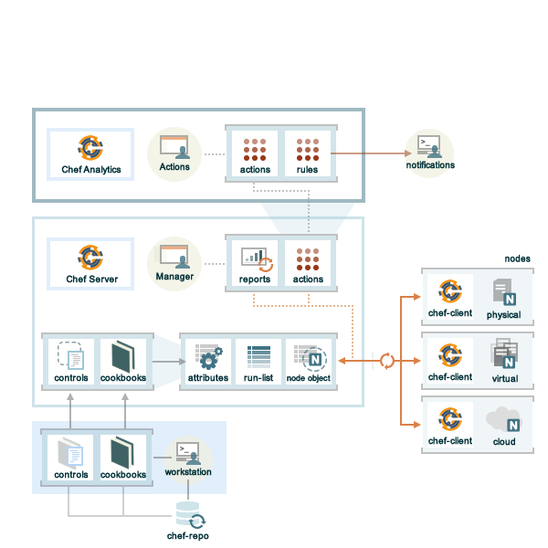

=====================================================
|chef analytics_title|
=====================================================

.. include:: ../../includes_analytics/includes_analytics.rst

|chef analytics_title| Components
=====================================================
The following diagram shows the relationships between the various elements of |chef analytics|, including how information is routed from various nodes to the |chef analytics| server (through the |chef server|) nodes, where reports about |chef client| run outcomes may be viewed, where rules are processed, and where |chef analytics| data may be viewed.

.. list-table::
   :widths: 60 420
   :header-rows: 1

   * - Feature
     - Description
   * - **Controls**
     - .. include:: ../../includes_analytics/includes_analytics_controls.rst
   * - **Audit Mode**
     - .. include:: ../../includes_chef_client/includes_chef_client_audit_mode.rst
   * - **Chef Actions**
     - .. include:: ../../includes_actions/includes_actions.rst
   * - **Reporting**
     - .. include:: ../../includes_reporting/includes_reporting.rst
   * - **Rules**
     - .. include:: ../../includes_analytics_rules/includes_analytics_rules.rst

The following sections discuss these elements (and their various components) in more detail.

Controls
=====================================================
.. include:: ../../includes_analytics/includes_analytics_controls.rst

|dsl recipe| Methods
-----------------------------------------------------
The following methods are built into the |dsl recipe| and may be used to configure tests that are run while the |chef client| is run in |chef client_audit|:

.. list-table::
   :widths: 60 420
   :header-rows: 1

   * - Method
     - Description
   * - ``control``
     - .. include:: ../../includes_chef_client/includes_chef_client_audit_mode.rst
   * - ``control_group``
     - .. include:: ../../includes_chef_client/includes_chef_client_audit_mode.rst

Audit Mode
=====================================================
.. include:: ../../includes_chef_client/includes_chef_client_audit_mode.rst

The Audit Run
-----------------------------------------------------
.. include:: ../../includes_chef_client/includes_chef_client_audit_mode_run.rst

|reporting_title|
=====================================================
.. include:: ../../includes_reporting/includes_reporting.rst

The Reporting Run
-----------------------------------------------------
.. include:: ../../includes_reporting/includes_reporting_run.rst

|rules_analytics_title|
=====================================================
.. include:: ../../includes_analytics_rules/includes_analytics_rules.rst

Rule Types
-----------------------------------------------------
.. include:: ../../includes_analytics_rules/includes_analytics_rules_syntax_message_types.rst

.. include:: ../../step_analytics_rules/step_analytics_rules_listen_on_port.rst

|chef actions_title|
=====================================================
.. include:: ../../includes_actions/includes_actions.rst

Architecture
-----------------------------------------------------
.. include:: ../../includes_actions/includes_actions_architecture.rst

Data Tracking
+++++++++++++++++++++++++++++++++++++++++++++++++++++
.. include:: ../../includes_actions/includes_actions_tracked_data.rst

User Interface
-----------------------------------------------------
.. include:: ../../includes_analytics/includes_analytics_ui.rst
