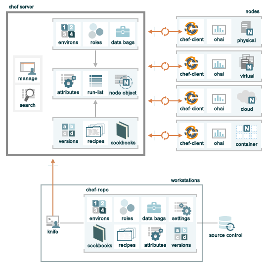

=====================================================
An Overview of |chef|
=====================================================

.. include:: ../../includes_chef/includes_chef.rst

The following diagram shows the relationships between the various elements of a |chef| organization, including the nodes, the server, and the workstations. These elements work together to provide |chef| the information and instruction that it needs so that it can do its job. As you are reviewing the rest of this doc, use the icons in the tables to refer back to this image.

.. include:: ../../includes_chef/includes_chef_key_elements.rst

The following sections discuss these elements (and their various components) in more detail.

Nodes
=====================================================
.. include:: ../../includes_node/includes_node.rst

There are two types of nodes that |chef| can manage:

.. list-table::
   :widths: 60 420
   :header-rows: 1

   * - Feature
     - Description
   * - .. image:: ../../images/icon_node_cloud.png
     - .. include:: ../../includes_node/includes_node_cloud.rst
   * - .. image:: ../../images/icon_node_physical.png
     - .. include:: ../../includes_node/includes_node_physical.rst

Some important components on nodes include:

.. list-table::
   :widths: 60 420
   :header-rows: 1

   * - Feature
     - Description
   * - .. image:: ../../images/icon_chef_client.png
     - .. include:: ../../includes_chef/includes_chef_client.rst
   * - .. image:: ../../images/icon_ohai.png
     - .. include:: ../../includes_ohai/includes_ohai.rst

|chef| uses RSA public key-pairs to authenticate a |chef client| with the |chef server| every time a |chef client| needs access to data that is stored on the |chef server|. This prevents any node from accessing data that it shouldn't and ensures that only nodes that are properly registered with the |chef| server can be managed by |chef|.

Workstations
=====================================================
.. include:: ../../includes_workstation/includes_workstation.rst

Some important components of workstations include:

.. list-table::
   :widths: 60 420
   :header-rows: 1

   * - Feature
     - Description
   * - .. image:: ../../images/icon_knife.png
     - .. include:: ../../includes_knife/includes_knife.rst
   * - .. image:: ../../images/icon_repository.png
     - .. include:: ../../includes_repository/includes_repository.rst

|chef| assumes that system administrators and developers know best about how the infrastructure should be put together. |chef| makes as few decisions on its own as possible. When a decision must be made, |chef| uses a reasonable default setting that can be easily changed by the system administrators and developers, most often by defining attributes in cookbooks that take precedence over the default attributes present on nodes.

Chef Server
=====================================================
.. include:: ../../includes_chef_server/includes_chef_server.rst

There are three types of |chef| servers:

.. list-table::
   :widths: 60 420
   :header-rows: 1

   * - Feature
     - Description
   * - .. image:: ../../images/icon_chef_hosted.png
     - .. include:: ../../includes_chef/includes_chef_hosted.rst

       |chef hosted| is based on the idea that an infrastructure management tool should be built around a collection of API primitives. By using an API to talk to a cloud provider (such as |amazon vpc|, |windows azure|, or |rackspace|), it allows the freedom to think of those primitives as building blocks. |chef| only needs to know about the desired state, how it should get there, and what the proper functionality of that desired state should be.
   * - .. image:: ../../images/icon_chef_private.png
     - .. include:: ../../includes_chef/includes_chef_private.rst

       |chef private| evolved out of a need for customers to have the same functionality provided by |chef hosted|, but located behind the firewall. |chef private| is the same as |chef hosted| in every other way. |chef hosted| is the largest |chef private| deployment in the world.
   * - 
     - .. include:: ../../includes_chef/includes_chef_open_source.rst

.. include:: ../../includes_chef/includes_chef_api_client.rst

In addition to node objects, policy, and cookbooks, a |chef server| includes:

.. list-table::
   :widths: 60 420
   :header-rows: 1

   * - Feature
     - Description
   * - .. image:: ../../images/icon_search.png
     - .. include:: ../../includes_search/includes_search.rst
   * - .. image:: ../../images/icon_manager.png
     - .. include:: ../../includes_chef/includes_chef_manager.rst

Node Objects
-----------------------------------------------------
.. include:: ../../includes_node/includes_node_object.rst

Some important node objects include:

.. list-table::
   :widths: 60 420
   :header-rows: 1

   * - Feature
     - Description
   * - .. image:: ../../images/icon_node_attribute.png
     - .. include:: ../../includes_node/includes_node_attribute.rst
   * - .. image:: ../../images/icon_run_lists.png
     - .. include:: ../../includes_node/includes_node_run_list.rst

Policy
-----------------------------------------------------
.. include:: ../../includes_chef/includes_chef_policy.rst

Some important aspects of policy include:

.. list-table::
   :widths: 60 420
   :header-rows: 1

   * - Feature
     - Description
   * - .. image:: ../../images/icon_roles.png
     - .. include:: ../../includes_role/includes_role.rst
   * - .. image:: ../../images/icon_data_bags.png
     - .. include:: ../../includes_data_bag/includes_data_bag.rst
   * - .. image:: ../../images/icon_environments.png
     - .. include:: ../../includes_environment/includes_environment.rst

Cookbooks
-----------------------------------------------------
.. include:: ../../includes_cookbooks/includes_cookbooks.rst

|chef| uses |ruby| as its reference language for creating cookbooks and defining recipes, with an extended DSL for specific resources. |chef| provides a reasonable set of resources, enough to support many of the most common infrastructure automation scenarios; however, this DSL can also be extended when additional resources and capabilities are required.

Some important components of cookbooks include:

.. list-table::
   :widths: 60 420
   :header-rows: 1

   * - Feature
     - Description
   * - .. image:: ../../images/icon_cookbook_attributes.png
     - .. include:: ../../includes_cookbooks/includes_cookbooks_attribute.rst
   * - .. image:: ../../images/icon_cookbook_recipes.png
     - .. include:: ../../includes_cookbooks/includes_cookbooks_recipe.rst
   * - .. image:: ../../images/icon_cookbook_versions.png
     - .. include:: ../../includes_cookbooks/includes_cookbooks_version.rst

|chef| will run a recipe only when asked. When |chef| runs the same recipe more than once, the results will be the same system state each time. When a recipe is run against a system, but nothing has changed on either the system or in the recipe, |chef| won't change anything.

In addition to attributes, recipes, and versions, the following items are also part of cookbooks:

* Resources and providers. A resource is a package, a service, a group of users, and so on. A resource tells |chef| which provider to use during a |chef| run for various tasks like installing packages, running |ruby| code, or accessing directories and file systems. The resource is generic: "install program A" while the provider knows what to do with that process on |debian| and |ubuntu| and |windows|. A provider defines the steps that are required to bring that piece of the system into the desired state. |chef| includes default providers that cover all of the most common scenarios.
* File distributions. A file distribution is a specific type of resource that tells a cookbook how to distribute files, including by node, by platform, or by file version.
* Definitions. A definition is used to create new resources by stringing together one (or more) existing resources.
* Libraries. A library allows the use of arbitrary |ruby| code in a cookbook, either as a way to extend the |chef| language or to implement a new class.
* Templates. A template is a file written in markup language that uses |ruby| statements to solve complex configuration scenarios.
* Configuration files. A metadata file to ensure that each cookbook is correctly deployed to each node.

Conclusion
=====================================================
The key underlying principle of |chef| is that you (the user) knows best about what your environment is, what it should do, and how it should be maintained. |chef| is designed to not make assumptions about any of those things. Only the individuals on the ground---that's you and your team---understand the technical problems and what is required to solve them. Only your team can understand the human problems (skill levels, audit trails, and other internal issues) that are unique to your organization and whether any single technical solution is viable.

The idea that you know best about what should happen in your organization goes hand-in-hand with the notion that you still need help. It is rare that a single individual knows everything about a very complex problem, let alone knows all of the steps that may be required to solve them. The same is true with tools. |chef| provides help with infrastructure management. And |chef| can help solve very complicated problems. |chef| also has a large community of users who have a lot of experience solving a lot of very complex problems. That |chef| community can provide knowledge and support in areas that your organization may not have and (along with |chef|) can help your organization solve any complex problem.

For more information ...
-----------------------------------------------------
For history of |chef|, where it came from and how it evolved, watch these two (short) videos:

* Part one: |http opscode youtube short part one|
* Part two: |http opscode youtube short part two|

For more information about |opscode|, cookbooks for |chef|, and the |chef| community:

* |http opscode|
* |http community|
* |http community cookbooks|

