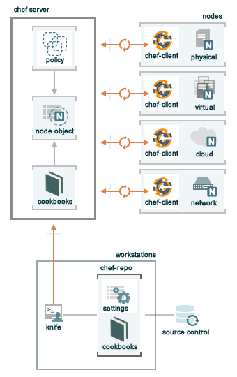

=====================================================
A Quick Overview of |chef|
=====================================================

.. include:: ../../includes_chef/includes_chef.rst

The following diagram shows the relationships between the various elements of a very simple |chef| organization, including the |chef hosted| server, a workstations, the |chef| repository, and some simple nodes that exist either in |virtualbox| or |amazon aws|.

The following sections discuss these elements in a bit more detail.

Nodes
=====================================================
.. include:: ../../includes_node/includes_node.rst

Workstations
=====================================================
.. include:: ../../includes_workstation/includes_workstation.rst

Knife
-----------------------------------------------------
.. include:: ../../includes_knife/includes_knife.rst

Repository
-----------------------------------------------------
.. include:: ../../includes_repository/includes_repository.rst

|github| is the most common location to store a |chef| repository that is used with a |chef hosted| account.

The Hosted Chef Server
=====================================================
.. include:: ../../includes_chef_server/includes_chef_server.rst

.. include:: ../../includes_chef/includes_chef_hosted.rst

Cookbooks
-----------------------------------------------------
.. include:: ../../includes_cookbooks/includes_cookbooks.rst

|chef| uses |ruby| as its reference language for creating cookbooks and defining recipes, with an extended DSL for specific resources. |chef| provides a reasonable set of resources, enough to support many of the most common infrastructure automation scenarios; however, this DSL can also be extended when additional resources and capabilities are required.

Conclusion
=====================================================
.. include:: ../../includes_chef/includes_chef_why_key_principle.rst

.. include:: ../../includes_chef/includes_chef_why_you_know_best.rst

For more information ...
-----------------------------------------------------
For history of |chef|, where it came from and how it evolved, watch these two (short) videos:

* Part one: |http opscode youtube short part one|
* Part two: |http opscode youtube short part two|

For more information about |opscode|, cookbooks for |chef|, and the |chef| community:

* |http opscode|
* |http community|
* |http community cookbooks|

