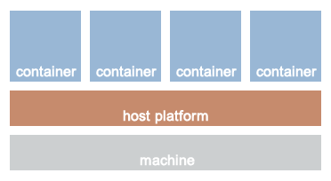
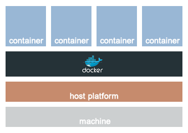
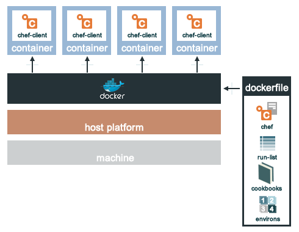

=====================================================
|chef| for Containers
=====================================================

.. include:: ../../includes_containers/includes_containers.rst

Using Docker
=====================================================
.. include:: ../../includes_containers/includes_containers_docker.rst

Install chef-container Library
-----------------------------------------------------
To use the |resource container_service| resource and the |subcommand knife container| subcommands (``knife docker build`` and ``knife docker init``), install the ``chef-container`` library. Run the following command:

.. code-block:: bash

   $ gem install chef-container

Using |chef| with |docker|
-----------------------------------------------------
.. include:: ../../includes_containers/includes_containers_docker_chef.rst

|dockerfile|
+++++++++++++++++++++++++++++++++++++++++++++++++++++
.. include:: ../../includes_containers/includes_containers_docker_dockerfile.rst

..
.. Using LXC
.. =====================================================
.. .. include:: ../../includes_containers/includes_containers_lxc.rst
.. 
.. .. image:: ../../images/containers_lxc.png
.. 

container_service Resource
=====================================================
.. include:: ../../includes_resources/includes_resource_container_service.rst

Syntax
-----------------------------------------------------
.. include:: ../../includes_resources/includes_resource_container_service_syntax.rst

Actions
-----------------------------------------------------
.. include:: ../../includes_resources/includes_resource_container_service_actions.rst

Attributes
-----------------------------------------------------
.. include:: ../../includes_resources/includes_resource_container_service_attributes.rst

Providers
-----------------------------------------------------
.. include:: ../../includes_resources/includes_resource_container_service_providers.rst

Examples
-----------------------------------------------------
|generic resource statement|

**Start apachectl in a container**

.. include:: ../../step_resource/step_resource_container_service_start_apache2.rst

knife-container
=====================================================
.. include:: ../../includes_plugin_knife/includes_plugin_knife_container.rst

docker build
-----------------------------------------------------
.. include:: ../../includes_plugin_knife/includes_plugin_knife_container_docker_build.rst

Syntax
+++++++++++++++++++++++++++++++++++++++++++++++++++++
.. include:: ../../includes_plugin_knife/includes_plugin_knife_container_docker_build_syntax.rst

Options
+++++++++++++++++++++++++++++++++++++++++++++++++++++
.. include:: ../../includes_plugin_knife/includes_plugin_knife_container_docker_build_options.rst

docker init
-----------------------------------------------------
.. include:: ../../includes_plugin_knife/includes_plugin_knife_container_docker_init.rst

Syntax
+++++++++++++++++++++++++++++++++++++++++++++++++++++
.. include:: ../../includes_plugin_knife/includes_plugin_knife_container_docker_init_syntax.rst

Options
+++++++++++++++++++++++++++++++++++++++++++++++++++++
.. include:: ../../includes_plugin_knife/includes_plugin_knife_container_docker_init_options.rst

Examples
+++++++++++++++++++++++++++++++++++++++++++++++++++++
**Create a Dockerfile**

.. include:: ../../step_plugin_knife/step_plugin_knife_container_docker_init_create_dockerfile.rst

For more information ...
=====================================================
For more information about containers:

* `Blog post by Julian Dunn about wrapper cookbooks <http://www.getchef.com/blog/2013/12/03/doing-wrapper-cookbooks-right/>`_
* `Blog post by Doug Ireton about cookbook anti-patterns <http://dougireton.com/blog/2013/02/16/chef-cookbook-anti-patterns/>`_
* `Blog post by Julian Dunn about role cookbooks <http://www.getchef.com/blog/2013/11/19/chef-roles-arent-evil/>`_

