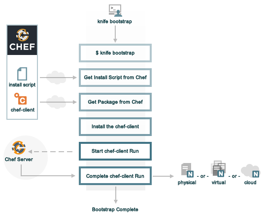

=====================================================
About Bootstrap
=====================================================

.. include:: ../../includes_install/includes_install_chef_client.rst

The following diagram shows the stages of the bootstrap operation, and then the list below the diagram describes in greater detail each of those stages.

During the ``knife bootstrap`` bootstrap operation, the following happens:

.. list-table::
   :widths: 150 450
   :header-rows: 1

   * - Stages
     - Description
   * - **$ knife bootstrap**
     - The ``knife bootstrap`` command is issued from a workstation. The hostname, IP address, or |fqdn| of the target node is issued as part of this command. An |ssh| connection is established with the target node using port 22. A shell script is assembled using the ``chef-full.rb`` (the default bootstrap template), and is then executed on the target node.
   * - **Get the install script from Chef**
     - On most |unix|- and |linux|-based architectures, the shell script that is derived from the ``chef-full.rb`` bootstrap template will make a request to |company_name| to collect the most recent version of a second shell script (``install.sh``).
   * - **Get the chef-client package from Chef**
     - The second shell script then gathers system-specific information and determines the correct package for the |chef client|. The second shell script makes a request to |company_name| and downloads the appropriate package.
   * - **Install the chef-client**
     - The |chef client| is installed on the target node.
   * - **Start the chef-client run**
     - The the shell script that is derived from the ``chef-full.rb`` bootstrap template executes the ``chef-client`` binary with a set of initial settings stored within ``first-boot.json`` on the node. ``first-boot.json`` is generated from the workstation as part of the initial ``knife bootstrap`` command.
   * - **Complete the chef-client run**
     - The |chef client| run proceeds, using HTTPS (port 443), and registers the node with the |chef server|.
