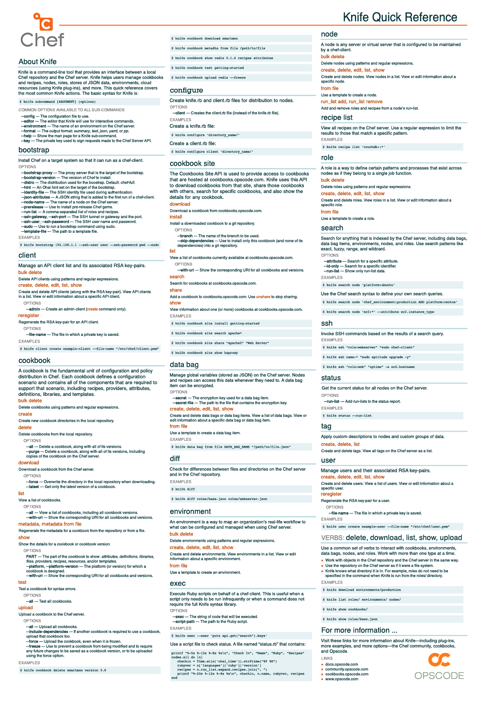

=====================================================
Standalone Image Files
=====================================================

.. note:: This page exists only to ensure that certain large images are uploaded to the ``/_images/`` folder on docs.opscode.com. This is because they do not appear in any of the regular topics, but should be available as a URL in case people need them.

Instead of using this page to view these images, click these links:

* http://docs.opscode.com/_images/qr_knife_web.png

* http://docs.opscode.com/_images/qr_knife_web_300dpi.png (use for printing and presentations)

.. image:: ../../images/qr_knife_web_300dpi.png

* http://docs.opscode.com/_images/overview_chef_draft_300dpi.png (use for printing and presentations)

.. image:: ../../images/overview_chef_draft_300dpi.png

* http://docs.opscode.com/_images/chef_run_300dpi.png (use for printing and presentations)

.. image:: ../../images/chef_run_300dpi.png

* http://docs.opscode.com/_images/server_components_300dpi.png (use for printing and presentations)

.. image:: ../../images/server_components_300dpi.png

* http://docs.opscode.com/_images/overview_chef_attributes_table_300dpi.png (table that shows attribute precedence)

.. image:: ../../images/overview_chef_attributes_table_300dpi.png

* http://docs.opscode.com/_images/oec_server_deploy_febe_300dpi.png

.. image:: ../../images/oec_server_deploy_febe_300dpi.png

* http://docs.opscode.com/_images/reporting_run_300dpi.png

.. image:: ../../images/reporting_run_300dpi.png

* http://docs.opscode.com/_images/overview_pushy_states_300dpi.png

.. image:: ../../images/overview_pushy_states_300dpi.png

