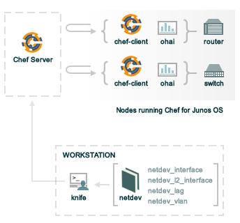

=====================================================
|juniper chef|
=====================================================

.. warning:: This is a draft for future functionality that will be added to both |chef server oec| and |chef server osc|.

.. include:: ../../includes_juniper/includes_juniper.rst

.. include:: ../../includes_juniper/includes_juniper_junos.rst

What is |juniper chef|?

* The ability to use the |chef client| to manage and configure routers, switches, and VLANs that run the |junos| operating system
* An open source, community cookbook managed by |opscode| that is used to create recipes that define how these devices should be managed
* A dedicated installer package that is used to install the |chef client| on nodes running |junos|
* Once installed, these nodes are managed like any other node

The netdev Lightweight Resources
-----------------------------------------------------
|cookbook name netdev|

The |cookbook netdev| cookbook contains the following lightweight resources: ``netdev_interface``, ``netdev_l2_interface``, ``netdev_lag``, and ``netdev_vlan``.

.. note:: These lightweight resources are part of the |cookbook netdev| cookbook (https://github.com/opscode-cookbooks/netdev).

netdev_interface
+++++++++++++++++++++++++++++++++++++++++++++++++++++
.. include:: ../../includes_lwrp/includes_lwrp_netdev_interface.rst

Actions
^^^^^^^^^^^^^^^^^^^^^^^^^^^^^^^^^^^^^^^^^^^^^^^^^^^^^
.. include:: ../../includes_lwrp/includes_lwrp_netdev_interface_actions.rst

Attributes
^^^^^^^^^^^^^^^^^^^^^^^^^^^^^^^^^^^^^^^^^^^^^^^^^^^^^
.. include:: ../../includes_lwrp/includes_lwrp_netdev_interface_attributes.rst

Examples
^^^^^^^^^^^^^^^^^^^^^^^^^^^^^^^^^^^^^^^^^^^^^^^^^^^^^
.. include:: ../../step_lwrp/step_lwrp_netdev_interface.rst

netdev_l2_interface
+++++++++++++++++++++++++++++++++++++++++++++++++++++
.. include:: ../../includes_lwrp/includes_lwrp_netdev_l2_interface.rst

Actions
^^^^^^^^^^^^^^^^^^^^^^^^^^^^^^^^^^^^^^^^^^^^^^^^^^^^^
.. include:: ../../includes_lwrp/includes_lwrp_netdev_l2_interface_actions.rst

Attributes
^^^^^^^^^^^^^^^^^^^^^^^^^^^^^^^^^^^^^^^^^^^^^^^^^^^^^
.. include:: ../../includes_lwrp/includes_lwrp_netdev_l2_interface_attributes.rst

Examples
^^^^^^^^^^^^^^^^^^^^^^^^^^^^^^^^^^^^^^^^^^^^^^^^^^^^^
.. include:: ../../step_lwrp/step_lwrp_netdev_l2_interface.rst

netdev_lag
+++++++++++++++++++++++++++++++++++++++++++++++++++++
.. include:: ../../includes_lwrp/includes_lwrp_netdev_lag.rst

Actions
^^^^^^^^^^^^^^^^^^^^^^^^^^^^^^^^^^^^^^^^^^^^^^^^^^^^^
.. include:: ../../includes_lwrp/includes_lwrp_netdev_lag_actions.rst

Attributes
^^^^^^^^^^^^^^^^^^^^^^^^^^^^^^^^^^^^^^^^^^^^^^^^^^^^^
.. include:: ../../includes_lwrp/includes_lwrp_netdev_lag_attributes.rst

Examples
^^^^^^^^^^^^^^^^^^^^^^^^^^^^^^^^^^^^^^^^^^^^^^^^^^^^^
.. include:: ../../step_lwrp/step_lwrp_netdev_lag.rst

netdev_vlan
+++++++++++++++++++++++++++++++++++++++++++++++++++++
.. include:: ../../includes_lwrp/includes_lwrp_netdev_vlan.rst

Actions
^^^^^^^^^^^^^^^^^^^^^^^^^^^^^^^^^^^^^^^^^^^^^^^^^^^^^
.. include:: ../../includes_lwrp/includes_lwrp_netdev_vlan_actions.rst

Attributes
^^^^^^^^^^^^^^^^^^^^^^^^^^^^^^^^^^^^^^^^^^^^^^^^^^^^^
.. include:: ../../includes_lwrp/includes_lwrp_netdev_vlan_attributes.rst

Examples
^^^^^^^^^^^^^^^^^^^^^^^^^^^^^^^^^^^^^^^^^^^^^^^^^^^^^
.. include:: ../../step_lwrp/step_lwrp_netdev_vlan.rst