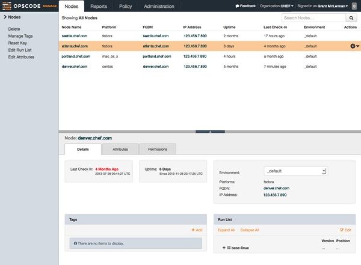
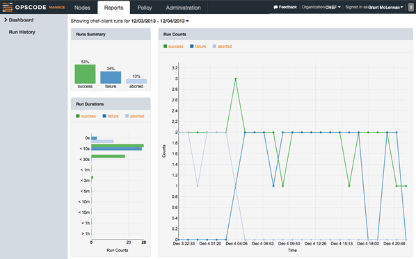
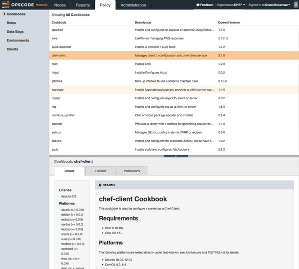
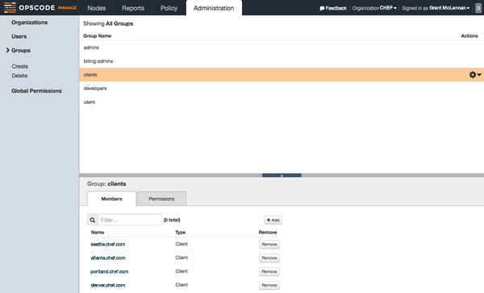

=====================================================
|chef manager|
=====================================================

.. include:: ../../includes_manager/includes_manager.rst

.. note:: |chef manager| is an add-on to |chef server oec| and must be :doc:`installed on the same physical hardware </install_manager>` as the |chef server oec| server.

Nodes
=====================================================
.. include:: ../../includes_node/includes_node.rst

Reports
=====================================================
.. include:: ../../includes_reporting/includes_reporting.rst

Policy
=====================================================
.. include:: ../../includes_chef/includes_chef_policy.rst

Admin
=====================================================
.. include:: ../../includes_manager/includes_manager_admin.rst

.. include:: ../../includes_server_rbac/includes_server_rbac.rst

