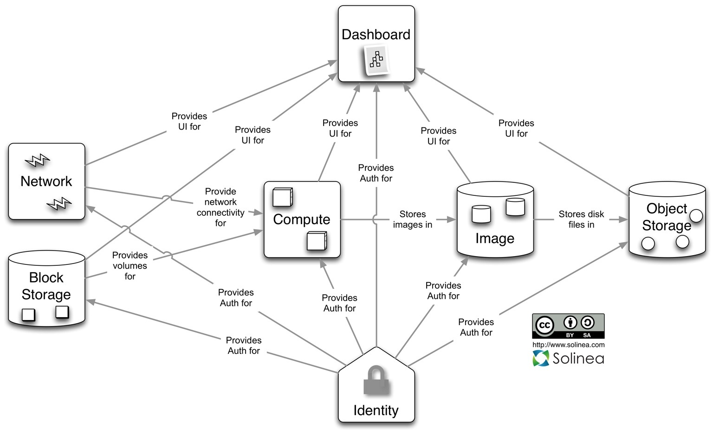

=====================================================
|chef openstack|: Architecture
=====================================================

This section describes the supported deployment scenarios for |chef openstack| and is based on the `OpenStack Grizzly <http://www.solinea.com/2013/06/15/openstack-grizzly-architecture-revisited/>`_ release.

There are a number of configuration options available, including block storage, hypervisors, databases, message queuing, networking, object storage, source builds, and so on. The current supported deployment scenarios includ:

.. list-table::
   :widths: 150 450
   :header-rows: 1

   * - Scenario
     - Description
   * - All-in-One Compute
     - A full |openstack compute| deployment on a single host. No object storage.
   * - Single Controller + N Compute
     - A single controller with 1 or more |openstack compute| nodes. No object storage.
   * - |vagrant|
     - A virtual instance on a single host using |vagrant|.

.. note:: |chef openstack| is under very active development for the |openstack grizzly| release. |openstack| is flexible and additional configurations will be supported in the future.

|chef openstack|: Single Controller + N Compute
=====================================================
.. include:: ../../includes_openstack/includes_openstack_architecture_1+n.rst

|chef openstack|: All-in-One Compute
=====================================================
.. include:: ../../includes_openstack/includes_openstack_architecture_allinone.rst

Roles
-----------------------------------------------------
.. include:: ../../includes_openstack/includes_openstack_architecture_allinone_roles.rst

Environments
-----------------------------------------------------
.. include:: ../../includes_openstack/includes_openstack_architecture_allinone_environments.rst

|chef openstack|: |vagrant|
=====================================================
.. include:: ../../includes_openstack/includes_openstack_architecture_vagrant.rst

Vagrantfile
-----------------------------------------------------
.. include:: ../../includes_openstack/includes_openstack_architecture_vagrant_vagrantfile.rst

Install
-----------------------------------------------------
.. include:: ../../includes_openstack/includes_openstack_architecture_vagrant_configure.rst

Environments
-----------------------------------------------------
.. include:: ../../includes_openstack/includes_openstack_architecture_vagrant_environment.rst

Usage
-----------------------------------------------------
.. include:: ../../includes_openstack/includes_openstack_architecture_vagrant_usage.rst