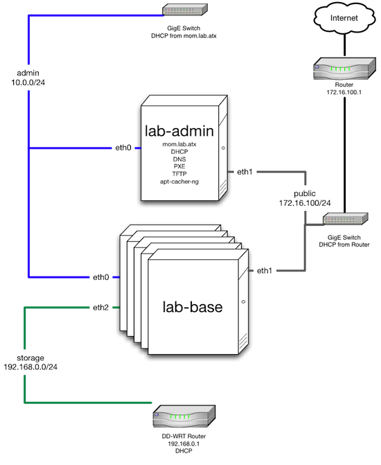

=====================================================
|chef openstack|: Example Deployment
=====================================================

.. include:: ../../includes_openstack/includes_openstack_example.rst

lab-repo
=====================================================
.. include:: ../../includes_openstack/includes_openstack_example_lab_repo.rst

Environment
-----------------------------------------------------
.. include:: ../../includes_openstack/includes_openstack_example_lab_repo_environment.rst

Roles
-----------------------------------------------------
.. include:: ../../includes_openstack/includes_openstack_example_lab_repo_roles.rst

lab-admin
+++++++++++++++++++++++++++++++++++++++++++++++++++++
.. include:: ../../includes_openstack/includes_openstack_example_lab_repo_roles_lab_admin.rst

lab-base
+++++++++++++++++++++++++++++++++++++++++++++++++++++
.. include:: ../../includes_openstack/includes_openstack_example_lab_repo_roles_lab_base.rst

Data Bags
-----------------------------------------------------
.. include:: ../../includes_openstack/includes_openstack_example_lab_repo_data_bags.rst

pxe_dust
+++++++++++++++++++++++++++++++++++++++++++++++++++++
.. include:: ../../includes_openstack/includes_openstack_example_lab_repo_data_bags_pxe_dust.rst

users
+++++++++++++++++++++++++++++++++++++++++++++++++++++
.. include:: ../../includes_openstack/includes_openstack_example_lab_repo_data_bags_users.rst

Cookbooks
-----------------------------------------------------
.. include:: ../../includes_openstack/includes_openstack_example_lab_repo_cookbooks.rst

Network
=====================================================
.. include:: ../../includes_openstack/includes_openstack_example_network.rst

Admin 10.0.0.0/24
-----------------------------------------------------
.. include:: ../../includes_openstack/includes_openstack_example_network_admin.rst

Public 172.16.100.0/24
-----------------------------------------------------
.. include:: ../../includes_openstack/includes_openstack_example_network_public.rst

Storage 192.160.0.0/24
-----------------------------------------------------
.. include:: ../../includes_openstack/includes_openstack_example_network_storage.rst

Hardware
=====================================================
.. include:: ../../includes_openstack/includes_openstack_example_hardware.rst

mom.lab.atx
-----------------------------------------------------
.. include:: ../../includes_openstack/includes_openstack_example_hardware_mom.rst

crushinator.lab.atx
-----------------------------------------------------
.. include:: ../../includes_openstack/includes_openstack_example_hardware_crushinator.rst

ignar.lab.atx/larry.lab.atx
-----------------------------------------------------
.. include:: ../../includes_openstack/includes_openstack_example_hardware_ignar.rst

lrrr.lab.atx
-----------------------------------------------------
.. include:: ../../includes_openstack/includes_openstack_example_hardware_lrrr.rst

