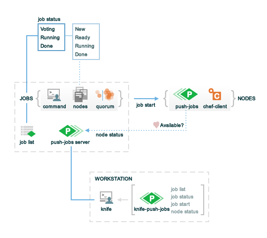

=====================================================
Pushy
=====================================================

.. warning:: DRAFT

.. include:: ../../includes_pushy/includes_pushy.rst

Components
=====================================================
.. include:: ../../includes_pushy/includes_pushy_component.rst

The following diagram shows the various components of |pushy|:

Jobs
-----------------------------------------------------
.. include:: ../../includes_pushy/includes_pushy_component_jobs.rst

Nodes
-----------------------------------------------------
.. include:: ../../includes_pushy/includes_pushy_component_nodes.rst

Workstations
-----------------------------------------------------
.. include:: ../../includes_pushy/includes_pushy_component_workstations.rst

push-jobs Cookbook
=====================================================
The |cookbook pushjobs| cookbook is used by |pushy| to install the |pushy| client on managed nodes, and then set up the |pushy| client to run as a service. In addition, |pushy| relies on a cookbook attribute to manage the whitelist, which is a list of jobs (and commands) that are available to |pushy|.

Whitelist
-----------------------------------------------------
.. include:: ../../includes_pushy/includes_pushy_whitelist.rst

.. 
.. Commented out, probably move to new file(s)
.. 
.. Messages
.. =====================================================
.. Pushy sends two types of messages: heartbeat and job.
.. 
.. Heartbeat Messages
.. -----------------------------------------------------
.. .. include:: ../../includes_pushy/includes_pushy_messages_heartbeat.rst
.. 
.. Job Messages
.. -----------------------------------------------------
.. .. include:: ../../includes_pushy/includes_pushy_messages_jobs.rst

Reference
=====================================================
The following sections describe the |knife| subcommands, the |api pushy|, and configuration settings used by |pushy|.

.. warning:: WILL INCLUDE THESE WHEN FINISHED.

knife-pushy
-----------------------------------------------------
http://docs.opscode.com/plugin_knife_pushy.html

Pushy API
-----------------------------------------------------
http://docs.opscode.com/api_pushy.html

ctl-pushy-client
-----------------------------------------------------
http://docs.opscode.com/ctl_pushy_client.html

pushy-server.rb
-----------------------------------------------------
http://docs.opscode.com/config_rb_pushy_server.html