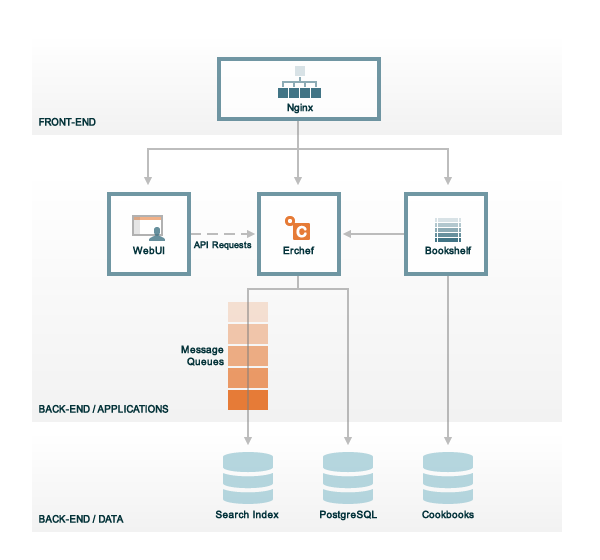

=====================================================
Chef Server Components
=====================================================

.. include:: ../../includes_chef_server/includes_chef_server.rst

.. include:: ../../includes_chef_server/includes_chef_server_component_erchef_background.rst

The following diagram shows the various components that are part of a |chef server| deployment. Depending on the chosen topology (standalone, tiered, or high availability), the number of servers and/or their roles within the topology (front-end or back-end) may change. But first, a quick discussion of each of the components and the relationships they have with one another.

The |chef server| has the following components:

.. list-table::
   :widths: 60 420
   :header-rows: 1

   * - Feature
     - Description
   * - Bookshelf
     - .. include:: ../../includes_chef_server/includes_chef_server_component_bookshelf.rst
   * - chef-expander
     - .. include:: ../../includes_chef_server/includes_chef_server_component_expander.rst
   * - chef-solr
     - .. include:: ../../includes_chef_server/includes_chef_server_component_solr.rst
   * - chef-webui
     - .. include:: ../../includes_chef_server/includes_chef_server_component_webui.rst
   * - Erchef
     - .. include:: ../../includes_chef_server/includes_chef_server_component_erchef.rst
   * - Nginx
     - .. include:: ../../includes_chef_server/includes_chef_server_component_nginx.rst
   * - PostgreSQL
     - .. include:: ../../includes_chef_server/includes_chef_server_component_postgresql.rst
   * - RabbitMQ
     - .. include:: ../../includes_chef_server/includes_chef_server_component_rabbitmq.rst
