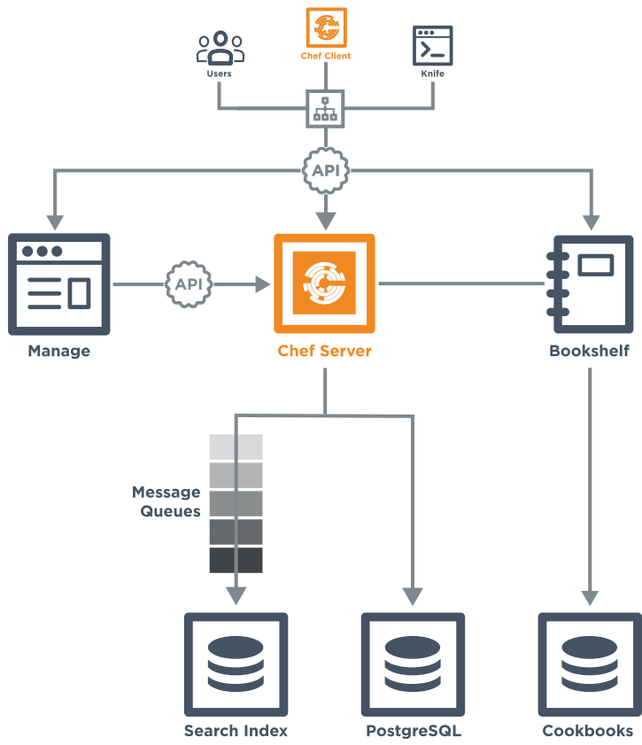

=====================================================
|chef server_title| Components
=====================================================

.. include:: ../../includes_chef_server/includes_chef_server.rst

.. include:: ../../includes_chef_server/includes_chef_server_component_erchef_background.rst

The following diagram shows the various components that are part of a |chef server| deployment and how they relate to one another.

.. list-table::
   :widths: 60 420
   :header-rows: 1

   * - Component
     - Description
   * - Clients
     - The |chef server| is accessed primarily by nodes that are under management by |chef|, as the |chef client| runs occur. It is also accessed by individuals who maintain cookbooks and policy that is stored on the |chef server|, typically from a workstation. And also by individual users with credentials to |chef server| components, such as the |chef manage|.
   * - Load Balancer
     - .. include:: ../../includes_chef_server/includes_chef_server_component_nginx.rst
   * - |chef manage_title|
     - .. include:: ../../includes_chef_server/includes_chef_server_component_webui.rst

       The |chef manage| uses the |api chef server| for all communication to the |chef server|.
   * - |chef server_title|
     - .. include:: ../../includes_chef_server/includes_chef_server_component_erchef.rst
   * - |chef bookshelf|
     - .. include:: ../../includes_chef_server/includes_chef_server_component_bookshelf.rst

       All cookbooks are stored in a dedicated repository.
   * - Message Queues
     - Messages are sent to the search index using the following components:
       
          #. .. include:: ../../includes_chef_server/includes_chef_server_component_rabbitmq.rst
          #. .. include:: ../../includes_chef_server/includes_chef_server_component_expander.rst
          #. .. include:: ../../includes_chef_server/includes_chef_server_component_solr.rst

       All messages are added to a dedicated search index repository.
   * - |postgresql|
     - .. include:: ../../includes_chef_server/includes_chef_server_component_postgresql.rst

Cookbooks on Amazon S3
=====================================================

The following diagram highlights the specific changes that occur when cookbooks are stored at an external location, such as |amazon s3|.

.. image:: ../../images/server_components_s3.svg
   :width: 500px

.. list-table::
   :widths: 60 420
   :header-rows: 1

   * - Component
     - Description
   * - Clients
     - The |chef server| will provide signed URLs for cookbook requests made by the various clients (individual users, |knife| requests, and from the |chef client| that is installed on nodes under management by |chef|).
   * - Load Balancer
     - The signed URLs for cookbooks are pointed here, and then routed to cookbook storage, as required.
   * - |chef server_title|
     - .. include:: ../../includes_chef_server/includes_chef_server_component_erchef.rst
   * - |amazon s3|
     - .. include:: ../../includes_chef_server/includes_chef_server_component_bookshelf.rst

       This represents the externally configured storage at |amazon s3|.

Use the following configuration settings in the |chef server rb| file to configure external cookbook storage using |amazon s3|:

.. list-table::
   :widths: 200 300
   :header-rows: 1

   * - Setting
     - Description
   * - ``bookshelf['access_key_id']``
     - |bookshelf id_access_key_s3| (This is configurable and may be pointed at external storage locations, such as |amazon ec2|. |cookbook external_storage_settings| Default value: generated by default.
   * - ``bookshelf['secret_access_key']``
     - |bookshelf id_secret_key_s3| (This is configurable and may be pointed at external storage locations, such as |amazon ec2|. |cookbook external_storage_settings| Default value: generated by default.
   * - ``bookshelf['vip']``
     - |ip_address virtual| Default value: ``127.0.0.1``.
   * - ``opscode_erchef['nginx_bookshelf_caching']``
     - |nginx bookshelf_caching| Default value: ``:off``.
   * - ``opscode_erchef['s3_bucket']``
     - |name s3_bucket| (This is configurable and may be pointed at external storage locations, such as |amazon ec2|. |cookbook external_storage_settings| Default value: ``bookshelf``.
   * - ``opscode_erchef['s3_parallel_ops_fanout']``
     - Default value: ``20``.
   * - ``opscode_erchef['s3_parallel_ops_timeout']``
     - Default value: ``5000``.
   * - ``opscode_erchef['s3_url_expiry_window_size']``
     - |s3_url_expiry_window_size| Default value: ``:off``.
   * - ``opscode_erchef['s3_url_ttl']``
     - |s3_url_ttl| If node bootstraps are timing out, increase this setting. Default value: ``28800``.

Configurable |postgresql|
=====================================================

.. warning:: This is about an upcoming feature in |chef server| 12.2.

The following diagram highlights the specific changes that occur when |postgresql| is configured and managed independently of the |chef server| configuration.

.. image:: ../../images/server_components_postgresql.svg
   :width: 500px

.. list-table::
   :widths: 60 420
   :header-rows: 1

   * - Component
     - Description
   * - |chef server_title|
     - .. include:: ../../includes_chef_server/includes_chef_server_component_erchef.rst
   * - |postgresql|
     - .. include:: ../../includes_chef_server/includes_chef_server_component_postgresql.rst

       This represents the independently configured set of servers that are running |postgresql| and are configured to act as the data store for the |chef server|.

Use the following configuration settings in the |chef server rb| file to configure |postgresql| for use with the |chef server|:

.. list-table::
   :widths: 200 300
   :header-rows: 1

   * - Setting
     - Description
   * - ``postgresql['external']``
     - Required. This value must be set to ``true`` to run |postgresql| external to the |chef server|. Must be set once only on a new installation of the |chef server| before the first ``chef-server-ctl reconfigure`` command is run. If this is set after a reconfigure or set to ``false``, any reconfigure of the |chef server| will return an error. Default value: ``false``.
   * - ``postgresql['vip']``
     - Required when ``postgresql['external']`` is set to ``true``. |ip_address virtual| The host for this IP address must be online and reachable from the |chef server| via the port specified by ``postgresql['port']``. Default value: ``"external-postgres-host-or-ip"``.
   * - ``postgresql['port']``
     - Optional when ``postgresql['external']`` is set to ``true``. The port used by |postgresql| if that port is **not** 5432. Default value: ``5432``.
   * - ``postgresql['db_superuser']``
     - Required when ``postgresql['external']`` is set to ``true``. The |postgresql| user name. This user must be granted either the ``CREATE ROLE`` and ``CREATE DATABASE`` permissions in |postgresql| or be granted ``SUPERUSER`` permission. This user must also have an entry in the host-based authentication configuration file used by |postgresql| (traditionally named ``pg_hba.conf``). Default value: ``'superuser_userid'``.
   * - ``postgresql['db_superuser_password']``
     - Required when ``postgresql['external']`` is set to ``true``. The password for the user specified by ``postgresql['db_superuser']``. Default value: ``'the password'``.
