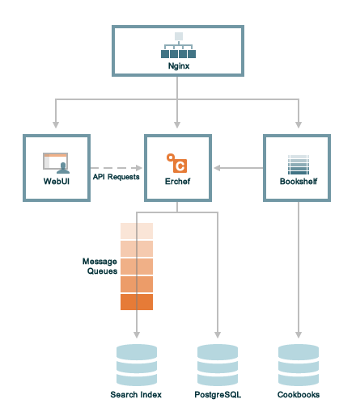

=====================================================
Chef Server Components
=====================================================

.. include:: ../../includes_chef_server/includes_chef_server.rst

.. include:: ../../includes_chef_server/includes_chef_server_component_erchef_background.rst

The following diagram shows the various components that are part of a |chef server| deployment.

|chef server| components:

.. list-table::
   :widths: 60 420
   :header-rows: 1

   * - Component
     - Description
   * - Bookshelf
     - .. include:: ../../includes_chef_server/includes_chef_server_component_bookshelf.rst
   * - chef-server-webui
     - .. include:: ../../includes_chef_server/includes_chef_server_component_webui.rst
   * - Erchef
     - .. include:: ../../includes_chef_server/includes_chef_server_component_erchef.rst
   * - Message Queues
     - Messages are sent to the Search Index using the following components:
       
       #. .. include:: ../../includes_chef_server/includes_chef_server_component_rabbitmq.rst
       #. .. include:: ../../includes_chef_server/includes_chef_server_component_expander.rst
       #. .. include:: ../../includes_chef_server/includes_chef_server_component_solr.rst
   * - Nginx
     - .. include:: ../../includes_chef_server/includes_chef_server_component_nginx.rst
   * - PostgreSQL
     - .. include:: ../../includes_chef_server/includes_chef_server_component_postgresql.rst
