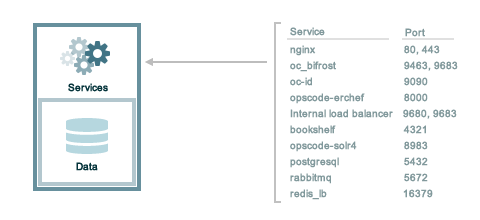
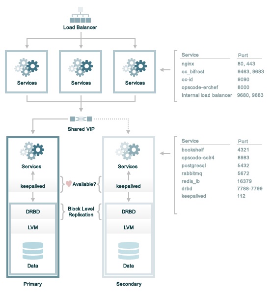
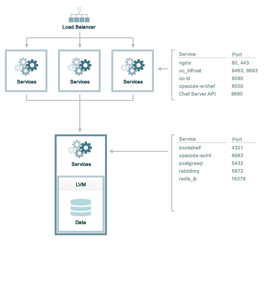

=====================================================
Firewalls and Ports
=====================================================

.. include:: ../../includes_server_firewalls_and_ports/includes_server_firewalls_and_ports.rst

.. include:: ../../includes_server_firewalls_and_ports/includes_server_firewalls_and_ports_listening.rst

Standalone
=====================================================
The following sections describe the ports that are required by the |chef server| in a standalone configuration:

.. include:: ../../includes_server_firewalls_and_ports/includes_server_firewalls_and_ports_loopback.rst

.. include:: ../../includes_server_firewalls_and_ports/includes_server_firewalls_and_ports_standalone.rst

High Availability
=====================================================
The following sections describe the ports that are required by the |chef server| in a high availability configuration that is running |drbd| and |keepalived| to manage the active/passive backend servers:

.. include:: ../../includes_server_firewalls_and_ports/includes_server_firewalls_and_ports_loopback.rst

Front End
-----------------------------------------------------
.. include:: ../../includes_server_firewalls_and_ports/includes_server_firewalls_and_ports_fe.rst

Back End
-----------------------------------------------------
.. include:: ../../includes_server_firewalls_and_ports/includes_server_firewalls_and_ports_be.rst

Tiered
=====================================================
The following sections describe the ports that are required by the |chef server| in a tiered configuration:

.. include:: ../../includes_server_firewalls_and_ports/includes_server_firewalls_and_ports_loopback.rst

Front End
-----------------------------------------------------
.. include:: ../../includes_server_firewalls_and_ports/includes_server_firewalls_and_ports_fe.rst

Back End
-----------------------------------------------------
.. include:: ../../includes_server_firewalls_and_ports/includes_server_firewalls_and_ports_tiered.rst

|chef analytics_title|
=====================================================
The following sections describe the ports that are required by |chef analytics|:

.. include:: ../../includes_server_firewalls_and_ports/includes_server_firewalls_and_ports_standalone.rst

.. 
.. Standalone (Temp)
.. =====================================================
.. .. warning:: This section is being reviewed and after review will be incorporated above.
.. 
.. The following sections describe the ports that are required by the |chef server| in a standalone configuration:
.. 
.. .. image:: ../../images/chef_server_ports_standalone.png
.. 
.. .. include:: ../../includes_server_firewalls_and_ports/includes_server_firewalls_and_ports_loopback.rst
.. 
.. .. include:: ../../includes_server_firewalls_and_ports/includes_server_firewalls_and_ports_standalone_proposed.rst
.. 
.. High Availability (Temp)
.. =====================================================
.. .. warning:: This section is being reviewed and after review will be incorporated above.
.. 
.. The following sections describe the ports that are required by the |chef server| in a high availability configuration that is running |drbd| and |keepalived| to manage the active/passive backend servers:
.. 
.. .. image:: ../../images/chef_server_ports_ha_drbd.png
.. 
.. .. include:: ../../includes_server_firewalls_and_ports/includes_server_firewalls_and_ports_loopback.rst
.. 
.. Front End
.. -----------------------------------------------------
.. .. include:: ../../includes_server_firewalls_and_ports/includes_server_firewalls_and_ports_fe_proposed.rst
.. 
.. Back End
.. -----------------------------------------------------
.. .. include:: ../../includes_server_firewalls_and_ports/includes_server_firewalls_and_ports_be_proposed.rst
.. 
.. Tiered (Temp)
.. =====================================================
.. .. warning:: This section is being reviewed and after review will be incorporated above.
.. 
.. The following sections describe the ports that are required by the |chef server| in a tiered configuration:
.. 
.. .. image:: ../../images/chef_server_ports_tiered.png
.. 
.. .. include:: ../../includes_server_firewalls_and_ports/includes_server_firewalls_and_ports_loopback.rst
.. 
.. Front End
.. -----------------------------------------------------
.. .. include:: ../../includes_server_firewalls_and_ports/includes_server_firewalls_and_ports_fe_proposed.rst
.. 
.. Back End
.. -----------------------------------------------------
.. .. include:: ../../includes_server_firewalls_and_ports/includes_server_firewalls_and_ports_tiered_proposed.rst
.. 
