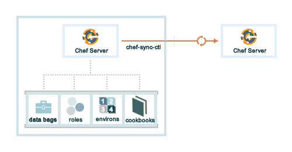
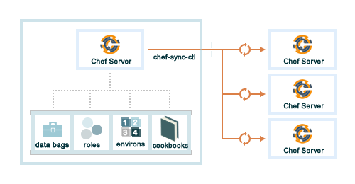

.. THIS PAGE IS IDENTICAL TO docs.getchef.com/server_replication.html BY DESIGN
.. THIS PAGE IS LOCATED AT THE /server/ PATH.

=====================================================
|chef replication|
=====================================================

|chef replication| provides a way to asynchronously distribute cookbook, environment, role, and data bag data from a single, primary |chef server| to one (or more) replicas of that |chef server|.

A daemon named ``ec-syncd`` runs on each of the replica instances of the |chef server| and periodically polls the primary |chef server| via the ``updated_since`` endpoint in the |api chef server|. The ``ec-syncd`` daemon requests a list of objects that have been updated since the last successful synchronization time. If there are updates, the ``ec-syncd`` daemon then pulls down the updated data from the primary |chef server| to the replica. 

The |chef sync ctl| command line tool is used to set up and maintain synchronization between one (or more) replica instances of the |chef server| and the primary |chef server|. 

Replication is configured on a per-organization and also a per-replica basis. Each organization must be configured to synchronize with each replica instance. Each organization may be configured to synchronize with all, some, or none of the available replica instances. 

For example, a single primary |chef server| and a single replica:

 
and for example, a single primary |chef server| and multiple replicas:

.. note:: |chef replication| requires |chef server| version 12.

|chef replication| should not be used for:

* Disaster recovery or backup/restore processes. The replication process is read-only and cannot be changed to read-write
* Synchronizing a replica instance with another replica instance
* Node re-registration. A node may be associated only with a single |chef server|

|chef sync ctl| (executable)
=====================================================

.. include:: ../../includes_ctl_chef_sync/includes_ctl_chef_sync.rst

manager-log
-----------------------------------------------------
.. include:: ../../includes_ctl_chef_sync/includes_ctl_chef_sync_manager_log.rst

prepare-org
-----------------------------------------------------
.. include:: ../../includes_ctl_chef_sync/includes_ctl_chef_sync_prepare_org.rst

sync-log
-----------------------------------------------------
.. include:: ../../includes_ctl_chef_sync/includes_ctl_chef_sync_log.rst

sync-start
-----------------------------------------------------
.. include:: ../../includes_ctl_chef_sync/includes_ctl_chef_sync_start.rst

sync-status
-----------------------------------------------------
.. include:: ../../includes_ctl_chef_sync/includes_ctl_chef_sync_status.rst
 
sync-stop
-----------------------------------------------------
.. include:: ../../includes_ctl_chef_sync/includes_ctl_chef_sync_stop.rst

unsynced-objects
-----------------------------------------------------
.. include:: ../../includes_ctl_chef_sync/includes_ctl_chef_sync_unsynced_objects.rst

|api chef server| Endpoints
=====================================================
The following |api chef server| endpoints support |chef replication|. 

/ORGS/ORG_NAME/updated_since
-----------------------------------------------------
.. include:: ../../includes_api_chef_server/includes_api_chef_server_endpoint_org_name_updated_since.rst

GET
+++++++++++++++++++++++++++++++++++++++++++++++++++++
.. include:: ../../includes_api_chef_server/includes_api_chef_server_endpoint_org_name_updated_since_get.rst