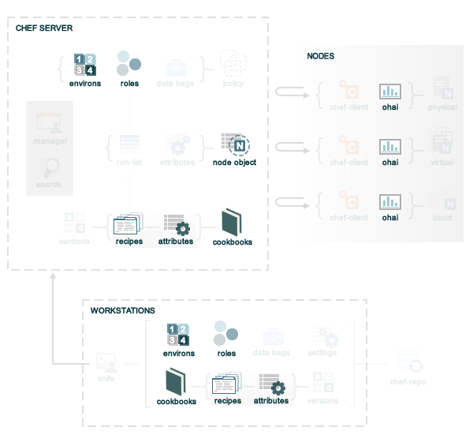

.. THIS PAGE DOCUMENTS chef-client version 11.0

=====================================================
About Attributes
=====================================================
.. include:: ../../includes_node/includes_node_attribute.rst

The |chef client| uses six types of attributes to determine the value that is applied to a node during the |chef client| run. In addition, the |chef client| sources attribute values from up to five locations. The combination of attribute types and sources allows for up to 15 different competing values to be available to the |chef client| during the |chef client| run.

So how does the |chef client| determine which value should be applied? Keep reading to learn more about how attributes work, including more about the types of attributes, where attributes are saved, and how the |chef client| chooses which attribute to apply.

Attribute Types
=====================================================
.. include:: ../../includes_node/includes_node_attribute_type.rst

.. include:: ../../includes_node/includes_node_attribute_persistence.rst

Attribute Sources
===================================================== 
Attributes are provided to the |chef client| from the following locations:

* Nodes (collected by |ohai| at the start of each |chef client| run)
* Attribute files (in cookbooks)
* Recipes (in cookbooks)
* Environments
* Roles

If we go back to the `overview of Chef <http://docs.opscode.com/chef_overview.html>`_, but then focus only on where attributes are located, it looks something like this:

where:

* Many attributes are maintained in the |chef repo| for environments, roles, and cookbooks (attribute files and recipes)
* Many attributes are collected by |ohai| on each individual node at the start of every |chef client| run
* The attributes that are maintained in the |chef repo| are uploaded to the |chef server| from the workstation, periodically
* The |chef client| will pull down the node object from the |chef server| (which contains the attribute data from the previous |chef client| run), after which all attributes (except ``normal`` are reset)
* The |chef client| will update the cookbooks on the node (if required), which updates the attributes contained in attribute files and recipes
* The |chef client| will update the role and environment data (if required)
* The |chef client| will rebuild the attribute list and apply attribute precedence while configuring the node
* The |chef client| pushes the node object to the |chef server| at the end of the |chef client| run; the updated node object on the |chef server| is then indexed for search and is stored until the next |chef client| run

Automatic (|ohai|)
-----------------------------------------------------
.. include:: ../../includes_ohai/includes_ohai_automatic_attribute.rst

.. include:: ../../includes_ohai/includes_ohai_attribute_list.rst

Attribute Files
-----------------------------------------------------
.. include:: ../../includes_cookbooks/includes_cookbooks_attribute_file.rst

Recipes
-----------------------------------------------------
.. include:: ../../includes_cookbooks/includes_cookbooks_recipe.rst

.. include:: ../../includes_cookbooks/includes_cookbooks_attribute.rst

Roles
-----------------------------------------------------
.. include:: ../../includes_role/includes_role.rst

.. include:: ../../includes_role/includes_role_attribute.rst

Environments
-----------------------------------------------------
.. include:: ../../includes_environment/includes_environment.rst

.. include:: ../../includes_environment/includes_environment_attribute.rst

Attribute Precedence
=====================================================
.. include:: ../../includes_node/includes_node_attribute_precedence.rst

Examples
-----------------------------------------------------
.. include:: ../../includes_node/includes_node_attribute_precedence_examples.rst
