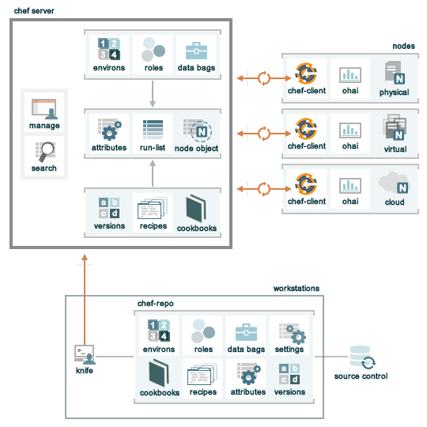

.. THIS PAGE DOCUMENTS chef-client version 11.2

=====================================================
An Overview of |chef|
=====================================================

Welcome to |chef|!

.. include:: ../../includes_chef/includes_chef.rst

|chef| Components
=====================================================
The following diagram shows the relationships between the various elements of |chef|, including the nodes, the server, and the workstations. These elements work together to provide the |chef client| the information and instruction that it needs so that it can do its job. As you are reviewing the rest of this doc, use the icons in the tables to refer back to this image.

.. include:: ../../includes_chef/includes_chef_11-all_key_elements.rst

The following sections discuss these elements (and their various components) in more detail.

Nodes
=====================================================
.. include:: ../../includes_node/includes_node.rst

.. include:: ../../includes_node/includes_node_types.rst

.. include:: ../../includes_node/includes_node_components.rst

Workstations
=====================================================
.. include:: ../../includes_workstation/includes_workstation.rst

.. include:: ../../includes_workstation/includes_workstation_11-x_components.rst

System administrators and developers know best about how their infrastructure should be put together. Therefore, the |chef client| makes as few decisions on its own as possible. When a decision must be made, the |chef client| uses a reasonable default setting that can be easily changed by the system administrators and developers, most often by defining attributes in cookbooks that take precedence over the default attributes present on nodes.

The Server
=====================================================
.. include:: ../../includes_chef_server/includes_chef_server.rst

There are three types of servers:

.. list-table::
   :widths: 60 420
   :header-rows: 1

   * - Server
     - Description
   * - Enterprise Chef
     - .. include:: ../../includes_chef/includes_chef_11_private.rst
   * - Hosted Enterprise Chef
     - .. include:: ../../includes_chef/includes_chef_hosted.rst
   * - Open Source Chef
     - .. include:: ../../includes_chef/includes_chef_11_open_source.rst

.. include:: ../../includes_chef/includes_chef_api_client.rst

In addition to node objects, policy, and cookbooks, a |chef server| includes:

.. list-table::
   :widths: 60 420
   :header-rows: 1

   * - Feature
     - Description
   * - .. image:: ../../images/icon_search.svg
          :width: 100px
          :align: center

     - .. include:: ../../includes_search/includes_search.rst
   * - .. image:: ../../images/icon_manage.svg
          :width: 100px
          :align: center

     - .. include:: ../../includes_chef/includes_chef_manager.rst

Node Objects
-----------------------------------------------------
.. include:: ../../includes_node/includes_node_object.rst

Some important node objects include:

.. list-table::
   :widths: 60 420
   :header-rows: 1

   * - Feature
     - Description
   * - .. image:: ../../images/icon_node_attribute.svg
          :width: 100px
          :align: center

     - .. include:: ../../includes_node/includes_node_attribute.rst
   * - .. image:: ../../images/icon_run_lists.svg
          :width: 100px
          :align: center

     - .. include:: ../../includes_node/includes_node_run_list.rst

Policy
-----------------------------------------------------
.. include:: ../../includes_chef/includes_chef_policy.rst

Some important aspects of policy include:

.. list-table::
   :widths: 60 420
   :header-rows: 1

   * - Feature
     - Description
   * - .. image:: ../../images/icon_roles.svg
          :width: 100px
          :align: center

     - .. include:: ../../includes_role/includes_role.rst
   * - .. image:: ../../images/icon_data_bags.svg
          :width: 100px
          :align: center

     - .. include:: ../../includes_data_bag/includes_data_bag.rst
   * - .. image:: ../../images/icon_environments.svg
          :width: 100px
          :align: center

     - .. include:: ../../includes_environment/includes_environment.rst

Cookbooks
-----------------------------------------------------
.. include:: ../../includes_cookbooks/includes_cookbooks.rst

The |chef client| uses |ruby| as its reference language for creating cookbooks and defining recipes, with an extended DSL for specific resources. A reasonable set of resources are available to the |chef client|, enough to support many of the most common infrastructure automation scenarios; however, this DSL can also be extended when additional resources and capabilities are required.

.. include:: ../../includes_cookbooks/includes_cookbooks_components.rst

Conclusion
=====================================================
.. include:: ../../includes_chef/includes_chef_about.rst

