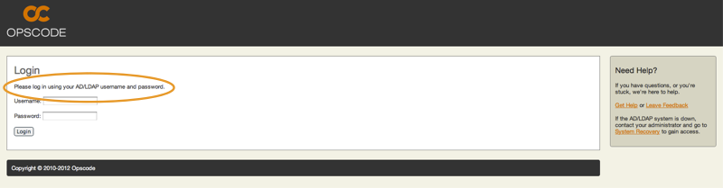
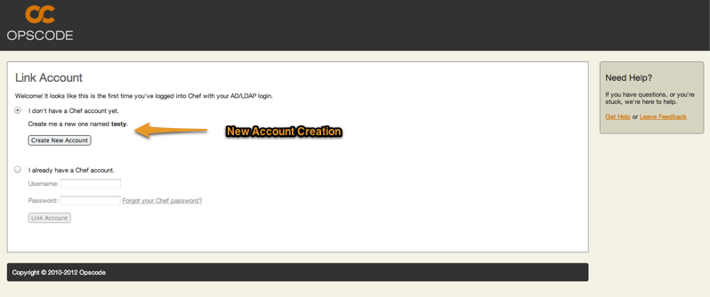
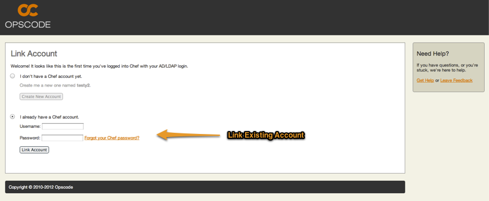
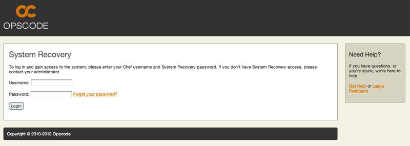

=====================================================
Active Directory / LDAP
=====================================================

.. warning:: This documentation is about |chef private|, an older version of the |chef server|. For documentation about the current version of the |chef server|, see http://docs.getchef.com/server/.

|chef private| supports |windows ad| and |ldap| authentication, which enables users to log in using corporate credentials instead of also having a unique password in |chef private|. To set up |windows ad| and/or |ldap|, follow the instructions in the |windows ad| / |ldap| installation section of this guide.

Login when AD / LDAP Enabled
=====================================================
When |windows ad| or |ldap| is enabled, the login page will authenticate users using those credentials.

First-time Login
=====================================================
For users who have not previously logged into |chef private|, they will log in using their |windows ad| or |ldap| credentials. After the initial login, each user will be presented with a screen asking them if they would like to create a new user with an account name derived from their login name, or if they would like to link their |windows ad| or |ldap| account to an existing |chef private| user account.

Once the user creates their new account they will be taken to the organization page, just as any other user would upon logging in. The user will not be shown the link account page again after their credentials are linked to a |chef private| account.

Accessing Chef
=====================================================
If a user already has a |chef private| account prior to |windows ad| or |ldap| being set up, then that user should initially login with their |windows ad| or |ldap| credentials. They will then be taken to the link account page and have the option of indicating that they already have a |chef private| account.

The user will put in their |chef private| account username and password. This will cause the account to be linked to the user's |windows ad| or |ldap| credentials, so that when the user logs they will already be using their existing |chef private| account. The user will not be shown the link account page again.

Accessing when AD/LDAP is down
=====================================================
In the event that the |windows ad| or |ldap| server goes down or becomes unreachable it is still possible for a user to log into |chef private| as long as they have a system recovery password set on their |chef private| account.

To set or remove a system recovery password for a user, see the instructions in the |private chef ctl| password section of this guide.

Once a user has a system recovery password, they can log into the system by clicking the System Recovery link found on the right hand side of the login page.

.. image:: ../../images_private_chef/private_chef_1x_system_recovery_link.png 

Once on the System Recovery page, the user will be asked to enter their username and system recovery password.

Once the user successfully logs in, they will gain access to the system and see the same screens as if |windows ad| or |ldap| were functioning.

If a user does not have a system recovery password enabled for their account (even if they have a system recovery password set) they will be redirected to the login page and a message will be shown stating that they do not have System Recovery enabled and to contact the system administrator.
